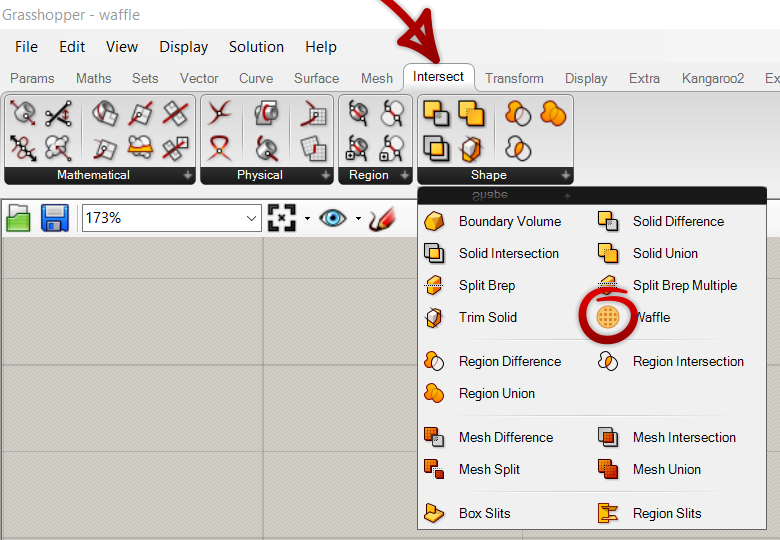
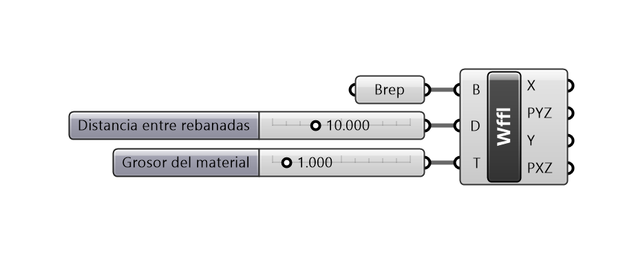
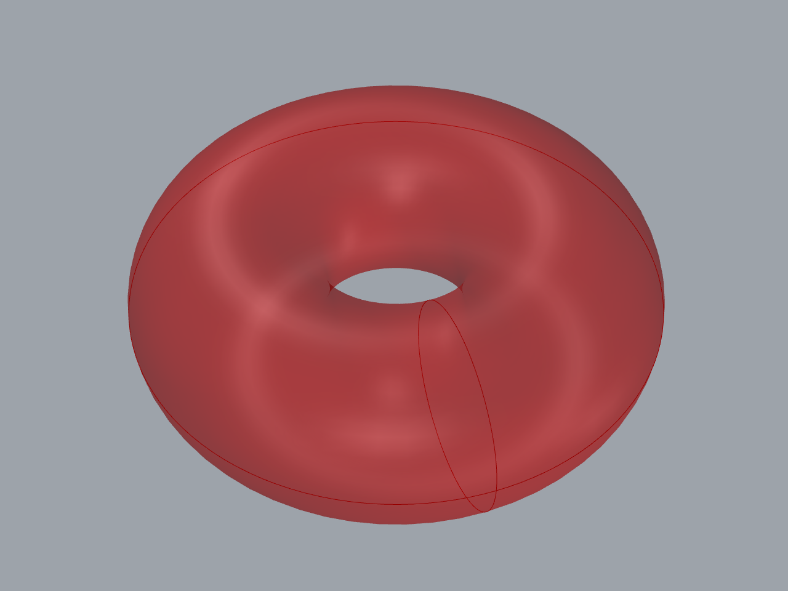
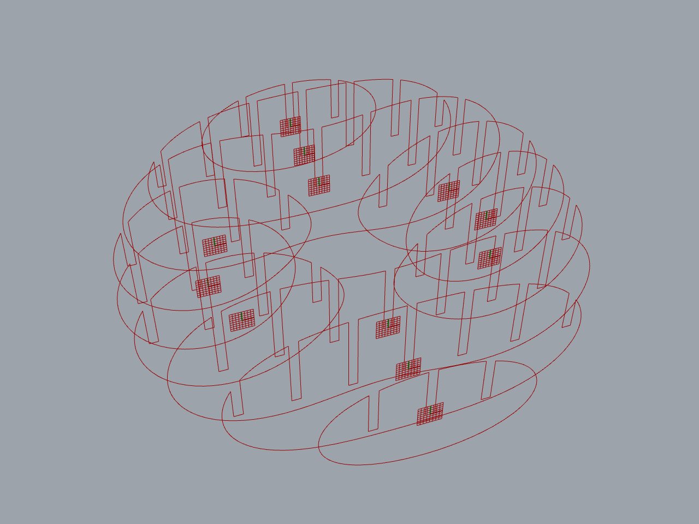
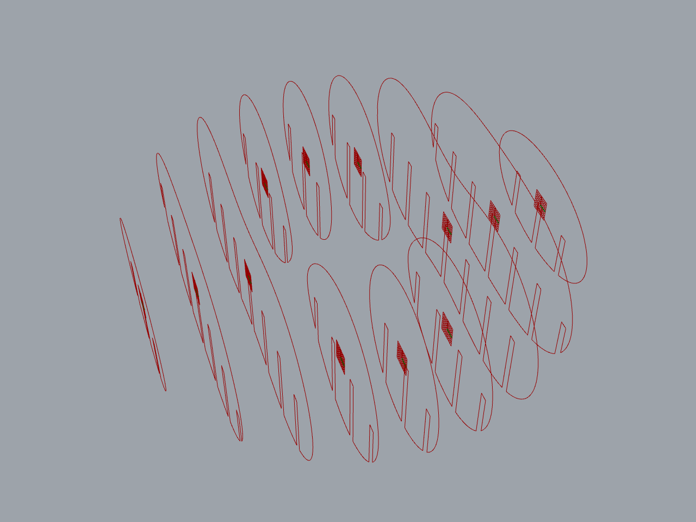
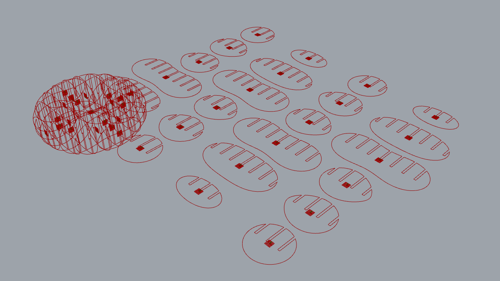

# Waffle for Grasshopper

Grasshopper plugin that generates a waffle structure from a closed surface/polysurface. Available at [https://www.food4rhino.com/app/waffle](https://www.food4rhino.com/app/waffle).

### Input Parameters

- `B` - Closed brep.
- `D` - Distance between slices.
- `T` - Material thickness.

### Output Parameters

- `X` - Slices in the X direction.
- `PYZ` - YZ orientation planes for slices in the X direction.
- `Y` - Slices in the Y direction.
- `PXZ` - XZ orientation planes for slices in the Y direction.

## Usage

The Waffle component is located in the _Intersect &rarr; Shape_ category.

When the component is placed on the canvas, data must be connected to all input parameters. If the surface/polysurface connected is not closed, or if the distance between slices or material thickness are equal to or less than 0, an error will occur.

**Note**: If the distance between slices is very small relative to the size of the surface/polysurface, the computation will become very complex and Rhino may become unresponsive.

Each orientation plane is located at the center of its respective slice, and these can be used to reorient the slices for CNC machining, for example.

