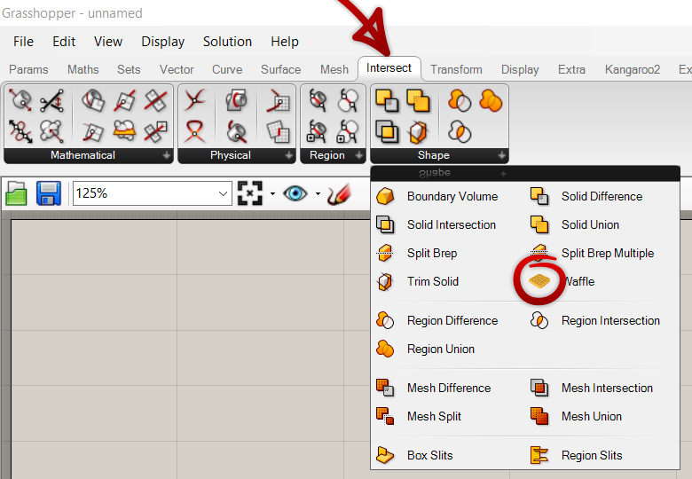
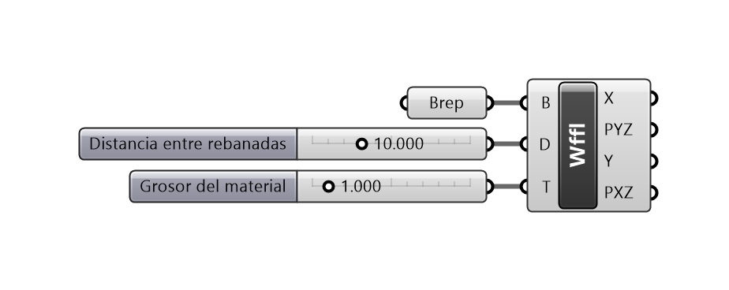

# Waffle para Grasshopper

_Plugin_ para Grasshopper que genera una estructura de waffle a partir de una superficie/polisuperficie cerrada. Disponible en [https://www.food4rhino.com/app/waffle](https://www.food4rhino.com/app/waffle).

### Parámetros de entrada

- `B` - Superficie/polisuperficie cerrada base.
- `D` - Distancia entre rebanadas.
- `T` - Espesor del material.

### Parámetros de salida

- `X` - Rebanadas en la dirección X.
- `PYZ` - Planos YZ de orientación para las rebanadas en la dirección X.
- `Y` - Rebanadas en la dirección Y.
- `PXZ` - Planos XZ de orientación para las rebanadas en la dirección Y.

## Uso

El componente Waffle se encuentra en la categoría _Intersect &rarr; Shape_.

Cuando se coloca el componente en el lienzo, se deben conectar datos en todos los parámetros de entrada. Si la superficie/polisuperficie que se conecta en no es cerrada, o si la distancia entre rebanadas o el espesor del material son iguales o menores a 0, habrá un error.

**Nota**: Si la distancia entre rebanadas es muy pequeña respecto al tamaño de la superficie/polisuperficie, el cómputo se volverá muy complejo y Rhino podría no responder.

Cada plano de orientación se encuentra en el centro de su respectiva rebanada, y estos se pueden usar para reorientar las rebanadas y usarlas para maquinado CNC, por ejemplo.

